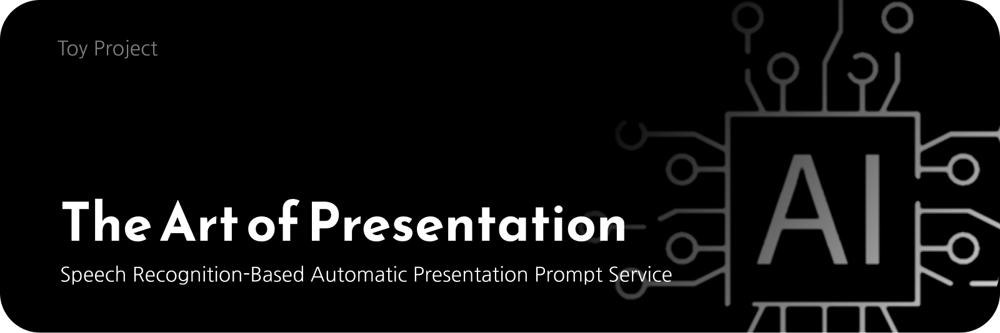
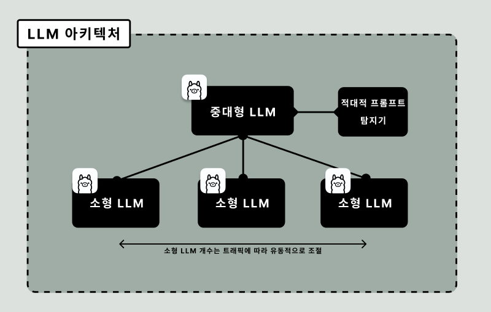
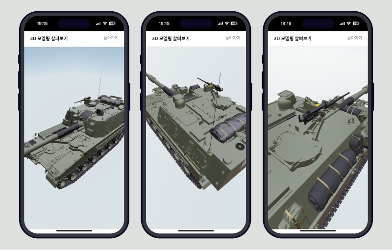
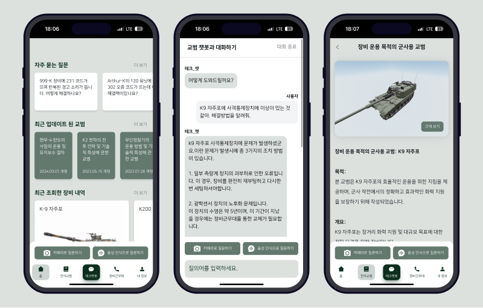
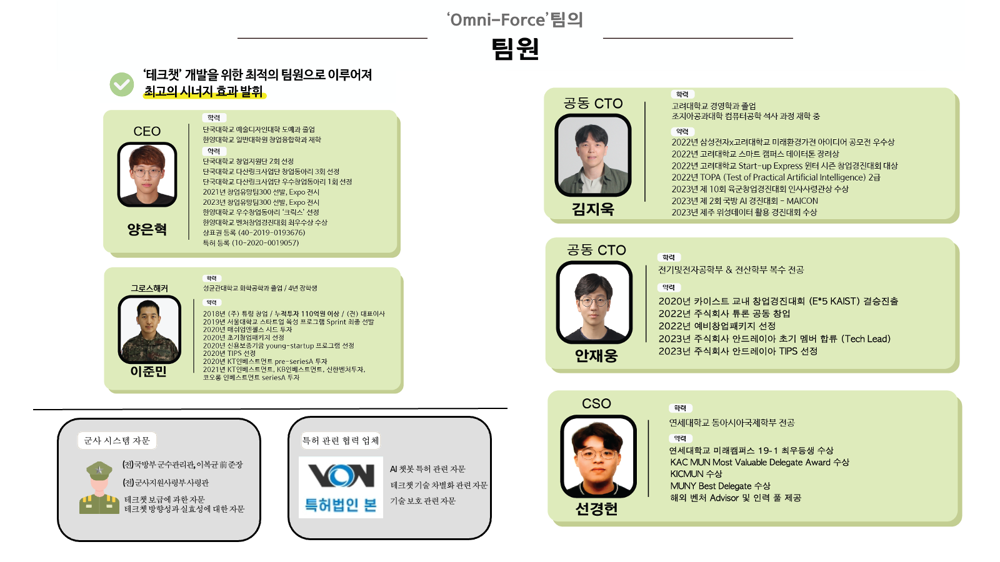

# Hello, Tech_Chat

 <strong>🏆 Chief of Staff of the Army Award, in 11th ROKA Entrepreneurship Competition 🏆</strong>
  
  
 <a href='https://github.com/ziweek/desirable-sea/blob/main/README.md'>KOREAN</a>
 &nbsp;|&nbsp;
 <a href='https://github.com/ziweek/desirable-sea/blob/main/README_EN.md'>ENGLISH</a>
  
  
 <strong>Guide Chatbot to Field Training Utilizing Generative AI</strong>
  
  
 
 
  
  
  
   
 
  
   
  
  
  
  
  
  
  

 
 
  

  
  <strong>Check out prototypes in the badge below<strong>
   
   
  
  
  

 
 

# 1. Introduction

> [!NOTE]
>
> - This idea is a project that won the Chief of Staff of the Army Award (Excellence Award) at the [2024 11th Korea Army Startup Competition](https://www.army-startup.co.kr/) hosted by the Republic of Korea Army Headquarters.
> - This idea involves developing an intelligent chatbot service powered by Large Language Models (LLMs) to overcome the limitations of traditional booklet-style field manuals. The project aims to research and develop an intelligent electronic manual platform that enables quick and accurate access to essential information for operating military equipment.

https://github.com/ziweek/tec-chat/assets/99459331/1265acf4-f164-467d-b7c6-bc51e887ddad

<table>
  <tr>
     <td>
      

        On-premise LLM ensemble architecture
      

    </td>
    <td>
      

       Realtime 3D rendering of equipments
      

    </td>
    <td>
      

        Project Application
      

    </td>
  </tr>
   <tr>
    <td>
      
    </td>
    <td>
      
    </td>
    <td>
      
    </td>
  </tr>
</table>
 

 
 

# 2. Implementation

 
<b>핵심기능</b>
 

#### 1. On-Premise 환경의 LLM 앙상블 구조

 <table>
   <tr>
     <td width="50%">
      
    </td>
    <td>
     
이 기능은 로컬 환경에 여러 언어 모델을 구축하고 연동하여 보안성을 강화하며, 대규모 데이터를 실시간으로 처리하는 데 필요한 성능을 제공합니다. 이를 통해 신속한 응답 및 정확한 정비 지원을 가능케 합니다.

    </td>
  </tr>
</table>

 

#### 2. 운용장비 구조도의 실시간 3D 렌더링

 <table>
   <tr>
     <td width="50%">
      
    </td>
    <td width="50%">
      
이 기능은 운용되는 장비의 구조도를 실시간으로 3D 렌더링하여 사용자에게 제공합니다. 이를 통해 사용자는 복잡한 장비 구조를 명확하게 이해할 수 있으며, 효율적으로 정비를 마칠 수 있습니다.

    </td>
  </tr>
</table>

 

#### 3. 멀티모달 지원으로 사용자 편의성 개선

 <table>
   <tr>
     <td width="50%">
      
    </td>
    <td width="50%">
     
해당 기능은 텍스트, 음성, 이미지 등 다양한 멀티모달 자원을 대상으로 질의어 입력을 지원하여 사용자의 편의성을 높입니다. 사용자는 자신에게 가장 편한 방식으로 상호작용할 수 있으며, 이를 통해 사용자 편의성을 극대화할 수 있습니다.

    </td>
  </tr>
</table>

 
 

  
<b>아키텍처</b>
 

#### 프로덕트 아키텍처

 <table>
  <tr>
     <td>
      
    </td>
  </tr>
   <tr>
    <td width="50%">
           
본 프로젝트의 아키텍처는 데이터 전처리 수행 서버(초고해생도 이미지 개선 딥러닝 모델), 핵심 기능 수행 서버(소형 객체 식별 딥러닝 모델), 그리고 웹 어플리케이션(프론트엔드와 벡엔드 및 데이터베이스)으로 구성되어 있습니다.

    </td>
  </tr>
</table>

 
 

# 3. 팀원

 <table>
  <tr>
     <td>
      
    </td>
  </tr>
</table>
