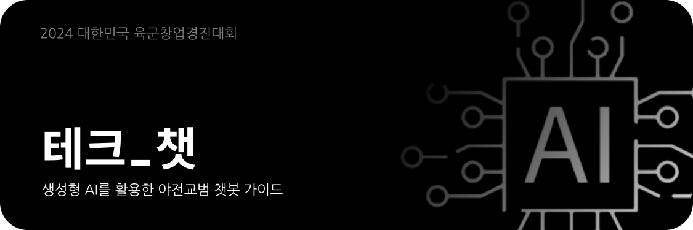

# 안녕, 테크_챗
 

 <!--
  <strong>🏆 2024 대한민국 육군창업경진대회 수상 작품 🏆</strong>
 -->
   
   
  <a href='https://github.com/ziweek/desirable-sea/blob/main/README.md'>
    KOREAN
  </a>
  &nbsp;|&nbsp;
  <a href='https://github.com/ziweek/desirable-sea/blob/main/README_EN.md'>
    ENGLISH
  </a>
   
   
  <strong>생성형 AI를 활용한 야전교범 챗봇 가이드</strong>
   
  <strong>Guide Chatbot to Field Training Utilizing Generative AI</strong>
   
   

  
  
  
   
 
  
  
   
  
  
  
  
  
  
  

 
 
  

  
  <strong>아래의 뱃지에서 프로토타입을 확인해보세요.<strong>
   
   
  
  
  

 
 

# 1. 개요

> [!NOTE]
> - 본 아이디어는, 대한민국 육군본부에서 주최하는 [2024 대한민국 육군창업경진대회](https://www.army-startup.co.kr/)에 출품한 프로젝트입니다.
>   
> - 본 아이디어는, LLM(대규모 언어 모델)을 활용한 지능형 챗봇 서비스를 개발하여, 기존의 책자형 야전교범의 문제점을 극복하고 군사장비의 운용부터 기능고장 발생시까지 필요한 솔루션을 신속하고 정확하게 도출할 수 있는 지능형 전자교범 플랫폼을 연구 및 개발하는 것입니다.

https://github.com/ziweek/tec-chat/assets/99459331/1265acf4-f164-467d-b7c6-bc51e887ddad

<table>
  <tr>
     <td>
      

        초고상도 이미지 개선 모델
      

    </td>
    <td>
      

        소형 객체 인식 모델링
      

    </td>
    <td>
      

        프로덕트 웹페이지
      

    </td>
  </tr>
   <tr>
    <td style="width:1/3;">
      
    </td>
    <td style="width:1/3;">
      
    </td>
    <td style="width:1/3;">
      
    </td>
  </tr>
</table>
 

 
 

# 2. 프로덕트

> [!IMPORTANT]
> 
 
<b>프로젝트 진행 현황</b>

>  
>
> - [x] 기획안 작성 완료 :ok_hand:
> - [x] 프론트엔드 개발 완료 :ok_hand:
> - [x] 벡엔드 개발 완료 :ok_hand:
> - [x] LLM 서버 개발 완료 :ok_hand:
> - [x] 데이터베이스 구축 완료 :ok_hand:
> - [x] 소개자료 및 시연영상 제작 완료 :ok_hand:
>
> 

> [!tip]
> 
 
<b>프로토타입 설치 방법</b>

>  
>
> iOS에서 설치하는 방법:
>
>  1. iOS 기기에서 Safari를 열고 [PWA가 호스팅된 URL](https://desirable-sea.vercel.app/)로 이동합니다.
>  2. 화면 하단에 있는 공유 아이콘을 탭합니다.
>  3. 화면을 아래로 스크롤하여 "홈 화면에 추가"를 탭합니다.
>  4. 우측 상단의 "추가"를 탭합니다.
>
> Android에서 설치하는 방법:
> 
>  1. Android 기기에서 Chrome 브라우저를 열고 [PWA가 호스팅된 URL](https://desirable-sea.vercel.app/)로 이동합니다.
>  2. 화면 우측 상단의 세 점 메뉴를 탭합니다.
>  3. "홈 화면에 추가"를 탭합니다.
>  4. 우측 상단의 "추가"를 탭합니다.
> 

 
<b>핵심기능</b>
 

#### 1. 초고해상도 이미지 개선 딥러닝 모델
   
 <table>
   <tr>
     <td width="50%">
      
    </td>
    <td>
     
데이터 전처리 과정에서 초고해상도 이미지 개선 딥러닝 모델을 원본 데이터에 적용하여 해상도를 크게 개선할 수 있었습니다.

    </td>
  </tr>
</table>

 

#### 2. 소형 객체 탐지 딥러닝 모델

 <table>
   <tr>
     <td width="50%">
      
    </td>
    <td width="50%">
      
데이터 전처리 과정에서 초고해상도 이미지 개선 딥러닝 모델을 원본 데이터에 적용하여 해상도를 크게 개선할 수 있었습니다.

    </td>
  </tr>
</table>

 

#### 3. 사용자 편의 기능

 <table>
   <tr>
     <td width="50%">
      
    </td>
    <td width="50%">
     
데이터 전처리 과정에서 초고해상도 이미지 개선 딥러닝 모델을 원본 데이터에 적용하여 해상도를 크게 개선할 수 있었습니다.

    </td>
  </tr>
</table>

 
 

  
<b>아키텍처</b>
 

#### 프로덕트 아키텍처

 <table>
  <tr>
     <td>
      
    </td>
  </tr>
   <tr>
    <td width="50%">
           
본 프로젝트의 아키텍처는 데이터 전처리 수행 서버(초고해생도 이미지 개선 딥러닝 모델), 핵심 기능 수행 서버(소형 객체 식별 딥러닝 모델), 그리고 웹 어플리케이션(프론트엔드와 벡엔드 및 데이터베이스)으로 구성되어 있습니다.

    </td>
  </tr>
</table>

 
 

# 3. 팀원

<table>
  <tr>
    <td width=80>
      
김지욱

    </td>
    <td width=1=150>
      

        
        
      

    </td>
    <td>
      

        이 프로젝트에 리더로 참여하여 먼저, 장기 방치 차량 문제에 직면해 이를 관리 하기 위한 지능형 플랫폼의 필요성을 깨닫게 되었습니다. Next.js, Google Map API, 그리고 FastAPI 등의 현대적인 기술들을 통합함으로써 우리의 솔루션은 효율적이고 사용자 친화적인 장기 방치 차량 관리를 실현하며, 위성데이터를 활용한 지능형 플랫폼의 발전에 일조하는 데 자부심을 느낄 수 있었습니다. 이 플랫폼은 제주의 차량문제를 혁신하고 미래 도시 계획에 기여하는 중요한 발판으로서의 역할을 할 것으로 기대됩니다.
      

    </td>
  </tr>
  
   <tr>
    <td width=80>
      
부선웅

    </td>
    <td width=150>
      

        
        
      

    </td>
    <td>
      

        CTO로 참여한 이 프로젝트는 최신 기술을 활용하여 제주의 장기 방치 차량 문제에 도전하는 흥미로운 경험이었습니다. 위성데이터와 딥러닝을 결합하여 차량을 정확하게 탐지하는 시스템을 개발하는 과정에서, 기술적인 도전과 혁신의 기회를 마주하게 되었습니다. 이 플랫폼은 미래 제주의 스마트한 지능형 시스템을 모색하는 데 있어 핵심적인 역할을 할 것으로 자부하고 있습니다.
      

    </td>
  </tr>
</table>
